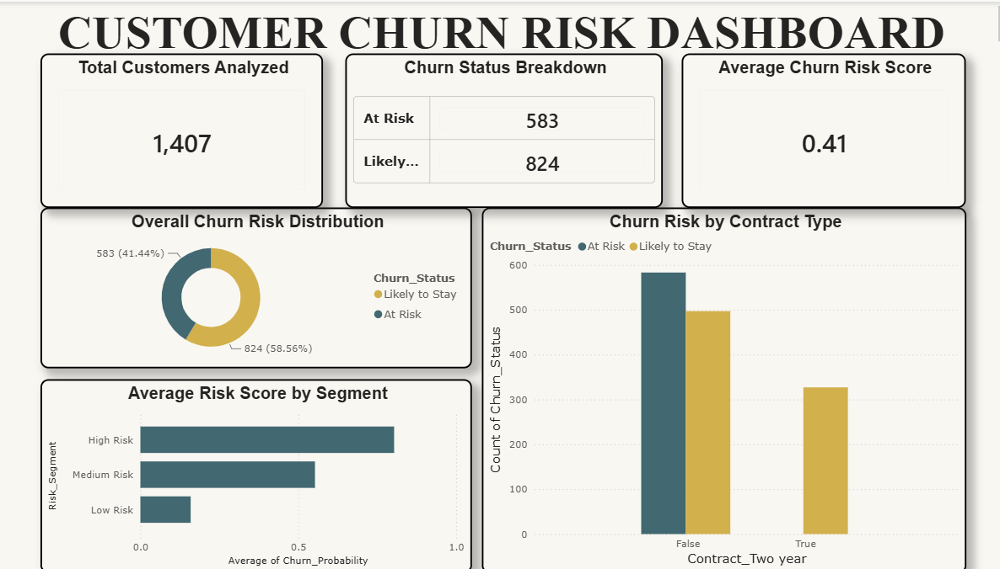

# Customer Churn Prediction & Retention Analytics

An end-to-end machine learning project that predicts customer churn and visualizes retention insights through an interactive Power BI dashboard.

## Overview
Built a churn prediction pipeline on 7,000+ telecom customer records, comparing Logistic Regression and Random Forest models. Identified key churn drivers and translated model output into a business-facing dashboard for retention decision-making.

## Tools & Technologies
- **Python** (pandas, scikit-learn) — data cleaning, modeling, evaluation
- **Power BI** (Power Query, DAX) — dashboard and visual analytics
- **Google Colab** — development environment

## Approach
1. Cleaned and preprocessed 7,032 customer records (handled missing values, encoded categorical features)
2. Trained and compared Logistic Regression and Random Forest models
3. Addressed class imbalance using `class_weight='balanced'` and evaluated using precision, recall, and ROC-AUC (not accuracy alone)
4. Tuned Random Forest (max_depth, min_samples_leaf) to improve recall from 50% to 80%
5. Identified top churn drivers using feature importance analysis
6. Built a Power BI dashboard visualizing churn risk by customer segment

## Results
- **Final model:** Tuned Random Forest
- **ROC-AUC:** 0.84
- **Recall (churn class):** 80%
- **Top churn drivers:** tenure, contract type, fiber internet service, payment method

## Dashboard
Includes KPI cards (total customers, at-risk count, average risk score), churn risk distribution, risk severity by segment, and churn rate by contract type.

## Dataset
[Telco Customer Churn (Kaggle)](https://www.kaggle.com/datasets/blastchar/telco-customer-churn)
